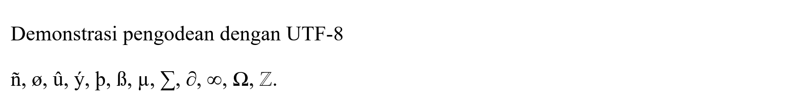
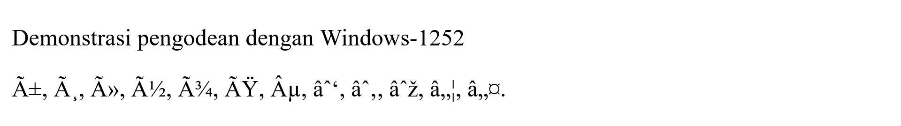
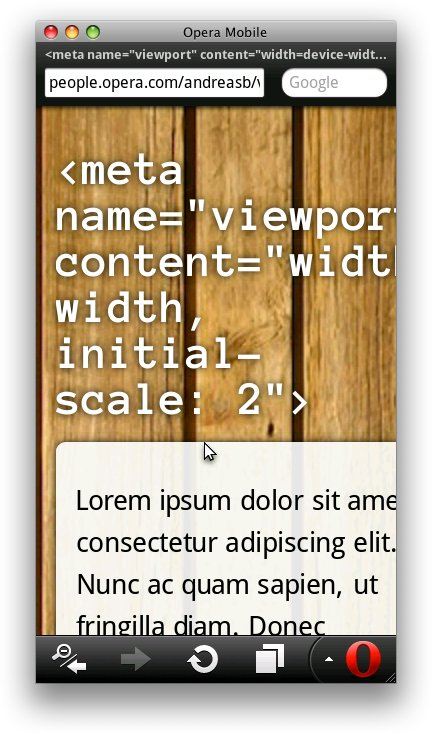
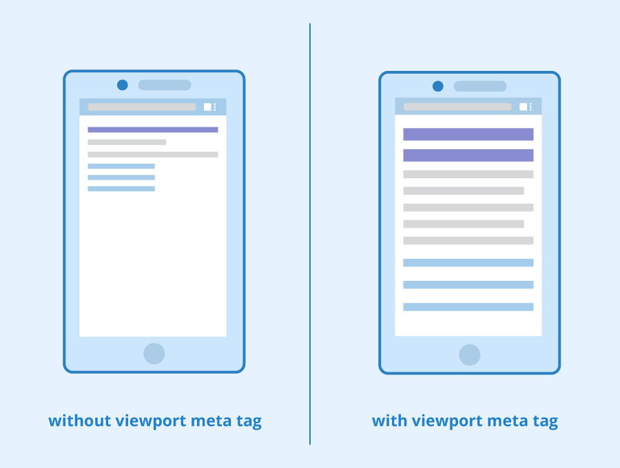
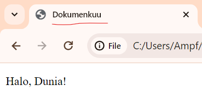

# Struktur Dasar HTML
## Pengantar Singkat
HTML (_HyperText Markup Language_) adalah bahasa markah yang umum digunakan untuk membuat dokumen Web. Disebut markah karena HTML menggunakan penanda (_mark_, _mark-up_, kemudian markah) untuk menyatakan strukturnya. Berkas HTML bisa disimpan dalam ekstensi ```.html``` atau ```.htm```. Ekstensi yang terakhir digunakan oleh Windows versi awal yang [hanya mendukung ektensi tiga karakter](https://learn.microsoft.com/en-us/openspecs/windows_protocols/ms-fscc/18e63b13-ba43-4f5f-a5b7-11e871b71f14).

HTML distandardisasi oleh sebuah organisasi internasional yang bernama [World Wide Web Consortium](https://www.google.com/url?sa=t&source=web&rct=j&opi=89978449&url=https://www.w3.org/&ved=2ahUKEwj9v4HJp5aFAxVNcWwGHQ8qB_sQFnoECAcQAQ&usg=AOvVaw2RgEUWrugv71FoFUwvQyU9) (W3C). W3C didirikan pada 1994 oleh Tim Berners-Lee, ilmuwan komputer yang juga menciptakan HTML dan World Wide Web.


## Struktur Dasar
Struktur dasar HTML modern yang umum digunakan adalah seperti ini:

```html
<!-- Struktur dasar --->
<!DOCTYPE html>
<html lang="id">
<head>
	<meta charset="UTF-8">
	<meta name="viewport" content="width=device-width, initial-scale=1.0">
	<title>Dokumenkuu</title>
</head>
<body>
	<p>Halo, Dunia!</p>
</body>
</html>
```
Mari aku antarkan kalian ke bawah untuk menjelaskan fungsi-fungsi kode ini.
***
```html
<!DOCTYPE html>
```
Elemen pembuka ini dinamakan Doctype, bertujuan agar peramban web dapat menampilkan halaman sesuai standar W3C dan menjaga kompatibilitas halaman web. Kalau tidak, peramban akan menampilkannya dalam [mode _quirk_](https://developer.mozilla.org/en-US/docs/Web/HTML/Quirks_Mode_and_Standards_Mode) yang menggunakan standar peramban lama non-W3C.
***
```html
<html lang="id">
```
Elemen ini disebut elemen akar (_root element_). Semua elemen selain ```<!DOCTYPE html>``` harus di bawahi elemen ini.

Atribut ```lang``` menurut [RFC 5646: Tags for Identifying Languages](https://datatracker.ietf.org/doc/html/rfc5646) akan membantu teknologi pembaca layar (biasa digunakan oleh penyandang tunanetra) menentukan dan membaca isi halaman. Jika tidak ada, pembaca layar akan beralih ke bahasa default sistem operasi yang mungkin menyebabkan kesalahan pengucapan.

Tentunya akan aneh jika bahasa Inggris diucapkan dengan bahasa Indonesia bukan?

Nilai ```lang``` merupakan [kode bahasa ISO 639-1](https://gist.github.com/Josantonius/b455e315bc7f790d14b136d61d9ae469).
***
```html
<head>
	<meta charset="UTF-8">
	<meta name="viewport" content="width=device-width, initial-scale=1.0">
	<title>Document</title>
</head>
```
Elemen ```<head>``` digunakan untuk menampung metadata halaman seperti ```<title>```, ```<script>```, dan ```<link>``` yang akan dijelaskan di bagian Lorem Ipsum. Metadata adalah informasi yang menjelaskan halaman itu sendiri layaknya metadata EXIF foto. Elemen ini hanya ada boleh satu dalam sebuah halaman

```<meta charset="UTF-8">``` digunakan untuk menetapkan representasi kode apa yang digunakan untuk menampilkan karakter (konsep representasi ini disebut _character encoding_ atau pengodean karakter). Dalam contoh di atas, kita menggunakan pengodean UTF-8 sebagai nilai atribut ```charset```.

Hingga awal tahun 2000-an, banyak situs web yang menggunakan pengodean ISO 8859-1 dalam ```<meta charset="windows-1252">```





```<meta name="viewport" content="width=device-width, initial-scale=1.0">``` memiliki tiga atribut. Pertama, atribut ```name="viewport"``` menyatakan metadata untuk _viewport_ situs web, yaitu area tampak sebagaimana yang ditampilkan pada layar atau monitor.

Atribut selanjutnya adalah ```content="width=device-width, initial-scale=1"```. Bagian ```width=device-width``` memberitahu peramban untuk mengatur lebar _viewport_ menyesuaikan lebar layar perangkat, sementara bagian ```intial-scale=1``` memberitahu peramban untuk memperbesar _viewport_ 1 proporsi dengan lebar layar perangkat.

Mau tahu bagaimana _viewport_ situs web jika ```initial-scale``` bernilai 2?

<p align="center" width="100%">
	
</p>

Elemen ini berperan penting dalam membuat situs web responsif terhadap berbagai ukuran layar atau monitor. Gambar di bawah ini adalah perbandingan tampilan situs web tanpa dan menggunakan meta _viewport_.

<p align="center" width="100%">
	
</p>

Terakhir adalah ```<title>Dokumenkuu</title>```. Elemen ini digunakan untuk menampilkan judul situs web di tab peramban. W3C menentukan bahwa hanya ada boleh satu elemen ```<title>``` dalam halaman meskipun di luar konteks isinya.

<p align="center" width="100%">
	
</p>

***
```html
<body>
	<p>Halo, Dunia!</p>
</body>
```
Ini adalah tempat utama kita menaruh isi halaman, yaitu di dalam ```<body>```. Hanya ada boleh satu elemen ini dalam sebuah halaman seperti halnya dengan ```<head>```.

## Sumber Untuk Eksplorasi
* [MDN Web Docs](https://developer.mozilla.org/en-US/) adalah sumber bagus untuk mencari dokumentasi dan bahan ajar mengenai HTML, CSS, JavaScript, HTTP, API Web, dan teknologi Web lainnya.
* [HTML Dogs](https://www.htmldog.com/) menyediakan tutorial dan referensi yang komprehensif untuk HTML dan CSS